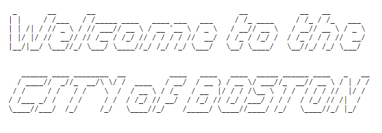

# Data Engineer's Handbook

## What we care about

* Shipping mentality
* Code is as simple as possible \(i.e. readability matters\)
* Knowledge sharing
* Making sure we don't incentivize the wrong behavior \(counting lines of code\)
* Reducing bugs

## Toolkit

| Name | What we use it for |
| :--- | :--- |
| [Civis Platform](tools/civis-platform.md) | Querying our data warehouse, running data pipelines, Jupyter notebooks, reports, and ML models. |
| [DBeaver](tools/dbeaver.md) | Writing/running SQL queries against multiple types of databases as well as database management. |
| [VSCode](tools/visual-studio-code.md) | Writing, testing, and debugging code \(mostly Python, SQL, and YAML\). |
| FileZilla | Accessing data on SFTP servers. |
| [GitHub](tools/github.md) | Version controlling our code. |
| [DBA Tools](data-engineers-handbook.md#dba-tools) | A set of handy tables, views, and functions that will help you administer and debug our data warehouse. |

## Development Environment

It is highly recommended that you use an integrated development environment \(IDE\) instead of a text editor like Sublime or Notepad. We use [VSCode](tools/visual-studio-code.md) and have built tools around VSCode to make your life easier.

Next, you'll need to install Python and all of the packages we use. You can do so by the instructions below:

1. Download the compressed **.tar.gz** file [here](https://s3.console.aws.amazon.com/s3/buckets/city-of-boston?prefix=development_environment/&region=us-east-1)
2. Unpack the file into a directory called my\_env \(you can name this whatever you like\)
   1. `mkdir -p my_env`
   2. `tar -xzf my_env.tar.gz -C my_env`
3. Activate the environment. This adds "my\_env/bin" to your PATH 
   1. `source my_env/bin/activate`
4. You can now run Python from in the environment
   1. `(my_env) $ python`
5. When you're done, deactivate the environment to remove it from your path
   1. `(my_env) $ source my_env/bin/deactivate`

## [civis\_pipelines](https://github.com/CityOfBoston/civis_pipelines)

All of our code lives in the civis\_pipelines monorepo. This repo is broken up into the following parts:

1. **components:** This directory houses all of our custom Python modules used for extracting, transforming, and loading data. They are modular, re-usable, and a core component of many of our pipelines.
2. **logic:** This is where all of our business logic lives. Logic can be any file type that is meant to be used as an input to a component but the majority of files are SQL and Python and are used to transform the data. We separate the business logic like this so that we can re-use both the logic and the component to the fullest extent.
3. **notebooks:** Jupyter notebooks used for analysis.
4. **scripts:** One-off scripts used for script templates or tasks in a data pipeline where a component can't be used.
5. **tests:** Both unit tests for our components as well as data unit tests that are used in our pipelines.
6. **utils:** Utility scripts that don't really fit anywhere else.
7. **workflows:** Data pipeline definitions.

### [Components](https://github.com/CityOfBoston/civis_pipelines/tree/master/components)

Components are custom scripts that are designed to be used as a task in a data pipeline. They generally do one thing but their behavior can change depending on the parameters that are passed to them. They can also be imported and used in your own custom script in the scripts folder. Each component corresponds to a custom script template in Civis and the script template is what we actually use in our data pipelines.

There are four basic types of components:

1. **Extract \(Import\)** components bring data from outside sources to the data pipeline. This can be anything from getting data from a database, hitting an API, or simply downloading a file from the Web.
2. **Transform** components perform transformations on the data. These are usually for data cleaning steps but are very flexible and can also be used for creating reports or files from the data.
3. **Export** components take data produced by the pipeline and send it to another source, e.g. upload it to a web server or database.
4. **Util** components aren't generally component's themselves but rather functions and classes which can be used in other scripts or components. There are some exceptions such as the [email ](https://github.com/CityOfBoston/civis_pipelines/blob/master/components/util/email_util.py)component. For more information on the distinction, see the pull request [here](https://github.com/CityOfBoston/civis_pipelines/pull/389).

Inside each folder, you'll find the components further separated by the language they were written in. This gives us flexibility in what language we write components if there is a better language for the task.


Currently, all of our components are written in Python 3.


### [Logic](https://github.com/CityOfBoston/civis_pipelines/tree/master/logic)

This directory contains logic to be used by your script or component. Logic files are files that contain business logic that are typically passed in as inputs into a component.

The directory structure follows the same general structure as the components. Generally, logic includes extracting or transforming data with the language of your choice.

As an example, you can find the SQL queries that are run by the database.py **extract** component in the **logic/extract/sql** folder. Not all components use logic files but if they do they will have a parameter called **source\_logic**.


Separating the business logic from the component increases the reusability of our code because we can use the component more generally and we can use the logic multiple times in many different tasks.


## Data Pipelines

Our Data Pipelines \(also commonly referred to as workflows in Civis\) are DAGs and are structured to be used with the [Mistral Workflow Service](https://docs.openstack.org/mistral/latest/). Read more about how Civis uses Mistral and workflows [here](https://civis.zendesk.com/hc/en-us/sections/360000222572-Workflows). 

### Credentials

At the top of our workflow definition we normally add the credentials we will be using throughout the workflow. When we say credentials we really mean the unique id that corresponds to a credential id in Civis Platform.

### Script Templates

## Code Review

Version control is a means to both backup code and track changes over time. While most software companies tend to operate under the "work quickly and break things" principle. This is mainly possible with continuous testing and deployment cycles, but since the City of Boston is a municipal government, we operate at a slower pace than most of our industry friends.

While a monorepo with no development branch is the latest trend for software, we use the old model of two branches. This is to ensure that at least one branch will be working at any given moment, and to facilitate a larger number of code reviews than most companies employ.

#### Branches

All branches are on the [civis\_pipelines](https://github.com/CityOfBoston/civis_pipelines) repo:

* Master branch is production code. It will locked down to only admins.
* Develop branch is the final checkpoint development branch into which all new code is merged for testing. Serves as the final staging branch.
* Various feature specific branches are the first pass at writing new code. When developing new code, create a new branch and name it logically to describe what you are doing on it.
* Add a year & month to the feature branch name, all feature branches will be deleted after a year.
* Please make sure that all commits are **descriptive**. They should give a good idea on exactly what your changes are for.

### Our Development Process

#### Step 1:

* Create new feature branch, fork it off the **develop** branch. Name it something that **specifically** describes your addition to the code. Ex: spatial-snap-class. 
  * Branch names should describe exactly what you are working on, not just the name of the project
* Write your code on it. Run the code on the isolated development environment on the ETL server. This will ensure you can break things while you are developing and no one will get upset. More on that below.

#### Step 2:

* When you are ready to commit the code into the main code base, open a pull request from the feature branch you created into the develop branch.
  * Set yourself as the Assignee.
  * Tag a person as the Reviewer.
    * Optional: if you want to tag someone with an ‘FYI good for you to check this out’, set them as the second Reviewer. This implies they should read over the pull request and acknowledge that they read it, but doesn’t make them responsible for the code.
* **Squash** all your commits when merging to the develop branch.
* This will kick off automated tests, as well as alert the reviewer that they have been tagged. The tests will check that all things in the Production Checklist below are done.
* The reviewer will get automatically notified by our slackbot

#### Step 3:

* The reviewer will take a look at the code \(all pull requests will be prioritized to happen as quickly as possible by the reviewer\). Please review the code within 24-48 hours but talk to your manager if you are unsure about priorities.
* The reviewer will either reject or approve.
  * If a rejection occurs, the reviewer will leave comments. Address the comments and re-request a review.
  * An approval means the code is good to go.

#### Step 4:

* Once the code was approved, merge the pull request into the develop branch.
* Unless you have specific reason not to, open a second pull request from develop into master branch.
* Delete your feature branch \(any feature branch over a year old will be deleted\)
* Ensure that the second round of checks between develop and master is conducted by at least one person

## DBA Tools

You may notice a schema named dba within Civis. This schema contains tables, views and functions that will give you information you need to see how the database is doing and check permissions, etc.

### Cheatsheet

If you only remember one thing - remember `SELECT * FROM dba.cheatsheet;`

This table contains a compilation of the most useful commands in case you forget them. You can copy/paste the commands and use them directly.



### Functions

#### dba.objects\_owned\_by\(&lt;role&gt;\)

This function returns the objects that are owned by a specified role.

#### dba.schema\_permissions\_for\_role\(&lt;role&gt;\)

Returns the schema names as well as whether or not the role has create or usage rights.

#### dba.user\_role\_memberships\(&lt;role&gt;\)

Returns the object id\(s\) and rolename\(s\) a role is a member of.

#### dba.users\_in\_group\(&lt;role&gt;\)

Returns the roles and ids of users in the specified group.

### [Event Triggers](https://www.postgresql.org/docs/current/event-triggers.html)

#### dba.trg\_create\_set\_owner

This function is used as part of an event trigger and is triggered whenever a 'CREATE TABLE', 'CREATE TABLE AS', 'CREATE VIEW', 'SELECT INTO' or 'CREATE FUNCTION' command is executed. It will assign the owner to the proper group roles so that users with write access don't have to worry about using SET role when creating new objects.

We assign these objects to group roles so that other write users can properly modify or drop the objects as needed. For example, if the object were under the individual user's role, other users would not be able to drop the object.

