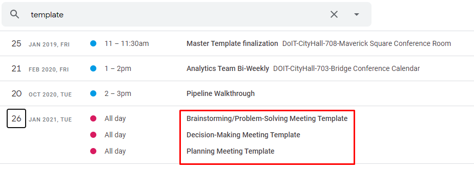

# Meetings

## Meeting Roles

We have roles specifically for meetings that help us achieve our goals and distribute responsibilities in a fair manner. Each of these roles is rotating which means that a new member will be assigned one of the roles before each meeting. You can use [this sheet](https://docs.google.com/spreadsheets/d/1x3cZvN_cSlZwnyZnpbymhU1rJiQfTz4ZsgRv-BdIhS8/edit#gid=0) for randomly assigning roles.

### Team Leader/Facilitator

The team leader is responsible for making sure the goals of a meeting are clear and that the objectives of the meeting are met.

**Responsibilities:**

* Setting the agenda.
* Keeping the conversation focused on meeting objectives.
* Keeping track of time.
* Making sure participants get an equal amount of talking time.

### Scribe

The scribe is responsible for documenting the key ideas and outcomes from the meeting.

**Responsibilities:**

* Writing down objectives accomplished and next steps.
* Documenting any key ideas/learnings from the meeting.

### Devil's Advocate

The devil's advocate is responsible for making sure we consider alternative viewpoints in our discussions.

**Responsibilities:**

* Brainstorming and voicing alternative views to key subjects being discussed.

## Types of Meetings

### Brainstorming/Problem Solving

### Decision Making

### Reflection

### Planning

### One-on-one

## Meeting Templates

### In Google Calendar

Click any link below to create a new meeting of that type!

#### [Brainstorming/Problem-Solving Meeting Template](https://calendar.google.com/event?action=TEMPLATE&tmeid=NjNhcWl0cXAxODFnZjE1dGU3cDdlazQxM3UgYm9zdG9uLmdvdl9sM2RrZjltYzYzOW11bzFndWJqOWt0bWxxOEBn&tmsrc=boston.gov_l3dkf9mc639muo1gubj9ktmlq8%40group.calendar.google.com)

#### [Decision-Making Meeting Template](https://calendar.google.com/event?action=TEMPLATE&tmeid=NzlzOWRkZWtybzM2Z3RhOWQ1YnFucGYwbTMgYm9zdG9uLmdvdl9sM2RrZjltYzYzOW11bzFndWJqOWt0bWxxOEBn&tmsrc=boston.gov_l3dkf9mc639muo1gubj9ktmlq8%40group.calendar.google.com)

#### [Planning Meeting Template](https://calendar.google.com/event?action=TEMPLATE&tmeid=N21jczM3aWVrdXZyMzlwbDY2aDlvdDVwYW0gYm9zdG9uLmdvdl9sM2RrZjltYzYzOW11bzFndWJqOWt0bWxxOEBn&tmsrc=boston.gov_l3dkf9mc639muo1gubj9ktmlq8%40group.calendar.google.com)

### How to create a new Google Calendar meeting template

1. In the Analytics Team Calendar on the web, **Create** a new event
2. Fill in the description and give the event a Title, Time, Guests, etc.
3. **Save** it, then **Open** it again
4. Under the event's options, click on **Publish event**
5. Copy the link under **Link to event**

### **How to edit a Google Calendar meeting template**

1. Find the original event, edit it, **Save** it, then **Open** it again
2. Under the event's options, click on **Publish event**

### **In Google Docs**



### **How to create a Google Doc template**

1. **Create** a new Google Doc and fill it out
2. **Copy** the url
3. Change **edit** at the end of the url to **copy**

## Indicators of a bad meeting

### A few people dominating the discussion

When there are one or two people talking the entire meeting it's usually safe to say that the rest of the people in the meeting are wondering _"why am I here?"_ We want to be deliberate in how we structure meetings to take advantage of the unique experience and expertise each member brings.


When everyone gets equal time to talk, it's a sign of a good meeting.


### Discussing what the meeting should be about

This is an indicator that either the meeting wasn't planned or the purpose wasn't clear. We want to make sure time spent in a meeting goes solely towards the objective at hand.


When the meeting objective is clear, we can focus on achieving our goals.


## Regular Recurring Meetings

### Scoping/Prioritization Meeting \(Long Term Planning\)

* **Objectives:**
  * Decide on which projects to take on
  * Decide priority of new projects
* **Format:** Vote on taking on each project using [1-5 cards](https://docs.boston.gov/analytics/guides/employee-handbook/communication#five-finger-voting-or-1-5-voting) with [Plan IT Poker](https://www.planitpoker.com/)
* **When:** Weekly, Monday mornings
* **Participants:** All team members

### Complexity Meeting \(Weekly Priorities\)

* **Objectives:**
  * Decide on the complexity of incoming tasks
  * Assign tasks?
* **Format:** Vote on the complexity of each task using Fibonacci cards with [Plan IT Poker](https://www.planitpoker.com/)
* **When:** Weekly, Monday afternoons
* **Participants:** All team members

### Analytics Roundtable

* **Objectives:**
  * Share important/interesting knowledge and break down silos
  * Give members opportunities to improve their presentation/communication skills
* **Format:** 3-4 presenters discuss their item on the agenda for ~15 minutes each.
* **When:** Monthly, Typically the third Tuesday afternoon
* **Participants:** All team members \(optional\)

### Documentation Day

* **Objectives:**
  * Document some of the projects or processes we haven't been able to
* **Format:** Usually we book a room at the Library, currently we use Google Meet but it's not necessarily a collaborative exercise
* **When:** Monthly, Typically the third Wednesday afternoon
* **Participants:** All team members \(optional\)

