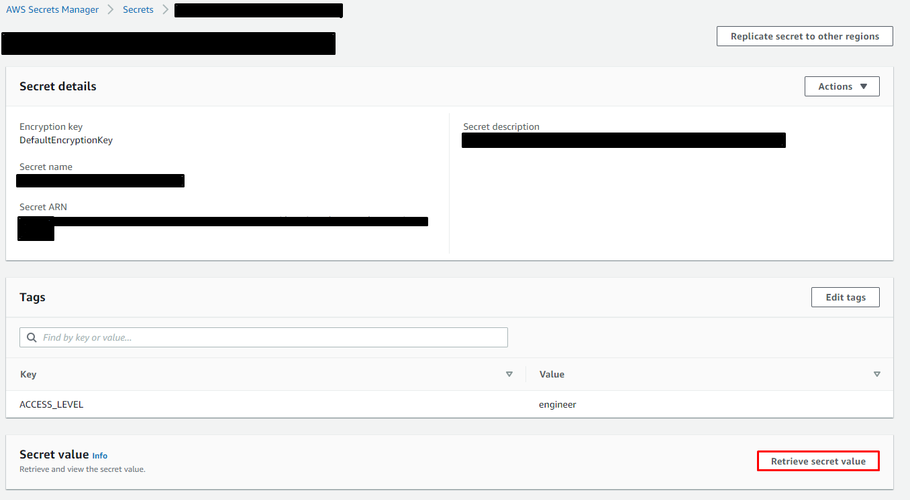

# Amazon Web Services

## What is AWS?

Amazon Web Services \(also referred to as AWS\) is a cloud provider - this means a supplier of servers and resources that are easily accessible online. Cloud servers come with several advantages to enterprise servers for small teams, namely that with proper usage typically only used infrastructure is paid for.

In other words, you only pay for what you use. This is in contrast to an on-premise server, where regardless of whether you use 1 node or all the nodes, you have to pay for the server and its power costs.

## Philosophy

A cloud strategy will always favor infrastructure as code as the most important piece of the cloud is the ability to replicate its features. At the City of Boston, we use [Terraform](https://www.terraform.io). This is to prevent vendor lockout, and more importantly, allow us to work on an open-source platform.

Terraform is an Infrastructure as Code software product that allows you to backup and deploy your entire cloud architecture as lines of code. This is invaluable when migrating to another cloud account or provider, and when things go wrong \(as they always do\)

## Services:

## EC2

This service allows us to create servers on-demand.


Be very careful about your security settings for all EC2 instances. Improper security settings can lead to the VPC being hacked.


## [S3](https://s3.console.aws.amazon.com/s3/home)

S3 stands for Simple Storage Service and we use it mostly for storing large volumes of raw data like backups of databases. You can think of this as the equivalent of file storage \(a folder on a computer\).

## [Secrets Manager](https://console.aws.amazon.com/secretsmanager/home)

The AWS Secrets Manager is a password or other secret management service provided by AWS. It allows us to securely store credentials and assign them to people based on the needed level of access. You will be able to view and search all stored secrets but you will only be able to access secrets you have permission for.

### Retrieve a Secret

1. Choose a secret you want to view
2. Click on **Retrieve secret value**

### Naming Conventions

Each secret has a name, description, and value components. In order to easily know if a credential already exists in storage, it's important to have consistent and clear naming conventions for the Secret Name.

When creating a secret, please include the following information in the name:

* Stage: dev or prod
* Type of credential: Database, API, Service, Server, etc
* Server / Host Name
* Database Name
* Username
* API / Service Name

Start from the most general attributes and end with specific ones.


\[stage\]/\[credential\_type\]/\[other type specific attributes\]/\[username\]

**&lt;-- General**                                                                                 **Specific --&gt;**


**Database example**


\[stage\]/\[credential\_type\]/\[server ip or host\_name\]/\[database\_name\]/\[username\]


prod/Database/VSQL99/DB2/de\_user

**Service example**

A service is an external 3rd party service we use.


\[stage\]/Service/\[service\_name\]/\[username\]


prod/Service/GoogleMaps/bostonaccount

### Create a New Secret

1. Click on **Store a new secret**
2. Choose a secret type \(most common is **other** or **database**\)
3. Fill in the fields or key/values using common naming conventions like **username** and **password**
4. Click on **Next**
5. Add the Secret name using our secret naming conventions
6. Add a description
7. Add the tag ACCESS\_LEVEL with **one** of the values: analyst, engineer, admin. This determines permissions for who can access the secret.
8. Click on **Next**
9. We don't usually use automatic rotation but may do so in the future
10. Click on **Next**
11. Review the details
12. Click on **Store**

### Granting a User Access to a Secret

As mentioned above, each secret should have an ACCESS\_LEVEL tag which corresponds to a group in AWS Identity and Access Management \(IAM\). In order to grant access, you can either change the tag on the secret to analyst, engineer, or admin OR you can change which group the user is in under the IAM groups section.

1. Go to the [IAM Users pane](https://console.aws.amazon.com/iam/home?region=us-east-1#/users) and click on the user name you want to grant access to
2. Click on **Groups**
3. Click **Add user to groups**
4. Select the appropriate group and click **Add to Groups**

