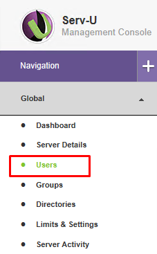

# Serv-U

The LAN Team is responsible for the server itself but the application that allows for user accounts is managed by Analytics and is called [Serv-U](https://www.serv-u.com).

In order to access this application, you must remote into the server from your city computer using the SFTP Administrator account (admins only) in [Secrets Manager](broken-reference). Once you've logged in you should be able to open the Serv-U Management Console and be able to manage user accounts.

## Users

To get to the users pane, click on the Users button in the left-hand navigation when inside the Serv-U Management Console.

### Add a New User

This section goes over how to create a new user account and specify which folders it has access to. By default, you should always create one account for each user. Accounts should not be shared by multiple users. Service accounts should only be shared with the applications using them and the user managing the application.

.png>)

1. Click on **Add...**
2. Fill out the **Login ID**, **Full Name**, **Email Address** and **Description** sections. Leave the other sections as the default values. The **Login ID** should be the user's employee id when applicable.
3. Copy the password and save it somewhere temporarily to send to the user later. You can only see this password once!
4. Check the box **User must change password at next login**
5. Set the home directory under **/E:/SFTP\_Root/...**
   1. You can either select an existing directory or create a new directory by clicking the **New Directory** button at the top
6. Once you've selected a home directory, click on **Directory Access** at the top
7. Click on **Add...**
8. Select the same directory path that you previously selected
9. Under the files section, select any checkbox the user needs **except** for the Execute box. For regular user accounts, we normally check all of the boxes under Files except for the Execute box.
10. Leave the checkboxes under the Directories section on the default settings
11. Click on **Save**
12. Click on **Save** again

That's it! Now you'll want to send the username and password to the user via [onetimesecret](https://onetimesecret.com) and let them change their password when they first log in. If you've created a service account, you should also save the password in [Secrets Manager](broken-reference).

### Changing a User's Password

1. Click on the user and click on **Edit...** at the bottom
2. Click on the lock icon next to password and save that password somewhere. You can only see it once!
3. Check the box **User must change password at next login**
4. Click on **Save**

That's it! Now you'll want to send the password to the user via [onetimesecret](https://onetimesecret.com) and let them know they will be asked to change their password when they first log in.
