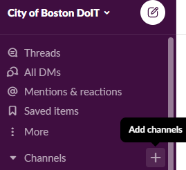

# Slack

Slack is an instant messaging tool our team uses for daily communication. You can join our Slack workspace here: [https://cityofboston-doit.slack.com/](https://cityofboston-doit.slack.com)

## [Channels](https://slack.com/features/channels)

[Click here](broken-reference) for a list of channels our team uses.

### Adding a new channel

## Slack Bots

### [GitBook](https://docs.gitbook.com/integrations/slack)

The GitBook slack integration allows us to search our documentation directly in Slack.

#### Search Documentation

`/gitbook [search query]`

### [Toast](https://toast.ninja)

Toast gives us notifications and reminders about GitHub pull requests.

#### Adding a new teammate

`/toast add [@teammate] [teammate_github_username]`

#### Viewing Pull Request Statuses

`/toast [me], [team], [stale]`
