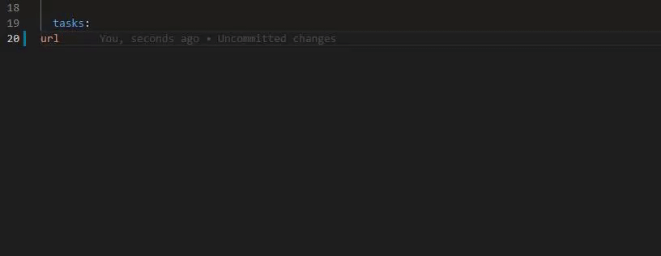

# Visual Studio Code

## Overview

#### Download



#### Official Docs



## Git Integration

## [Debugger](https://code.visualstudio.com/docs/editor/debugging)

## [Extensions](https://marketplace.visualstudio.com/VSCode)

We've bundled all of the extensions mentioned below into an [extension pack](https://marketplace.visualstudio.com/items?itemName=Boston.boston-data-engineering) that will let you install them all at once.

## [Code Snippets](https://code.visualstudio.com/docs/editor/userdefinedsnippets)

Code snippets are templates that make it easier to enter repeating code patterns, such as loops or conditional-statements.
 In Visual Studio Code, snippets appear in IntelliSense \(`Ctrl+Space`\) mixed with other suggestions, as well as in a dedicated snippet picker \(Insert Snippet in the Command Palette\).

### [Data Pipeline Code Snippets](https://github.com/CityOfBoston/civis_pipelines/blob/master/.vscode/pipeline.code-snippets)

We've developed snippets for making data pipelines easily. All of our custom ETL components are available and we are working on including the Civis Import/Export modules. In order to use them, simply type in a word or phrase of the task you'd like and then press `Ctrl + Space` to bring up the IntelliSense options.

