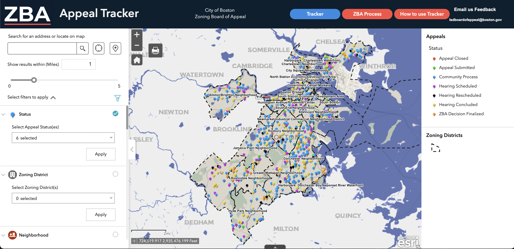

# ZBA Appeals Tracker

## Project Link: [ZBA Tracker Map](https://experience.arcgis.com/experience/c019ba9a25cb4f33bb6cdd2f69b543d4/page/page\_0/)

## Overview

#### Summary

Following the order from Mayor Walsh, Boston is committed to increasing transparency in the processes around the Zoning Board of Appeal (ZBA). The Inspectional Services Department (ISD) at the City is tasked with ensuring compliance with the zoning code. If an application for a permit is refused because of a zoning violation, applicants are able to appeal the decision to the ZBA and ask for an exception, sometimes known as a “variance.” If the ZBA grants relief, then the appellant is able to continue with the process of obtaining a permit. &#x20;

This tool was built to provide greater transparency in the ZBA process. Each record in this tracker represents an appeal of a denied permit application; the original permit application is known as the “parent application.” To find out more information about the original permit application, visit our [Permit Finder tool](https://permitfinder.boston.gov). To learn more about the ZBA process, [visit their website](https://www.boston.gov/departments/inspectional-services/how-file-appeal-zoning-board#start-the-appeal-process).

This tool is an ArcGIS Online WebApp embedded into an Experience Builder Site with supporting web pages.

#### Scheduling __ / Repeat Work

New appeals automatically upload to the map as they are submitted and appeal statuses change.

## Contacts

Kelly Mackey, Assistant Commissioner, Admin. & Finance | ISD: [kelly.mackey@boston.gov](mailto:kelly.mackey@boston.gov)

Marcio Fonseca, Management Analyst, ISD: [marcio.fonseca.jr@boston.gov](mailto:marcio.fonseca.jr@boston.gov)

Brittany Silva, Management Analyst, ISD: [brittany.silva@boston.gov](mailto:brittany.silva@boston.gov)

IT Support: [AnalyticsTeam@Boston.gov](mailto:AnalyticsTeam@Boston.gov)
